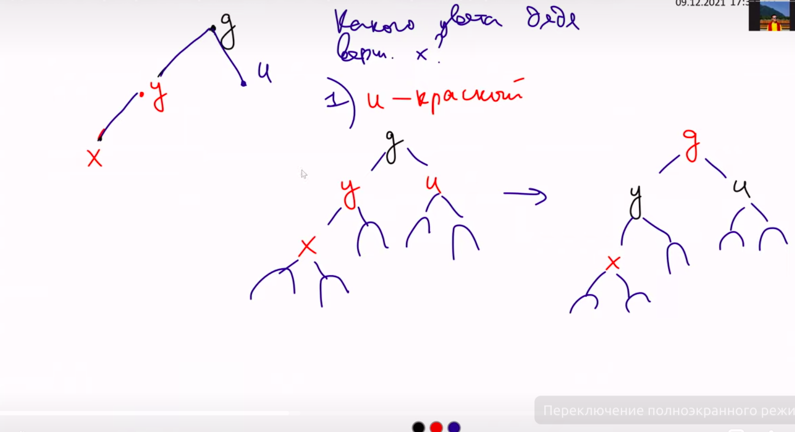
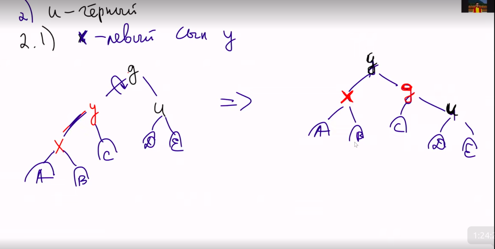

# Лекция [Степанова](https://www.youtube.com/watch?v=T70nn4EyTrs&t=23s)
[wiki конспекты](https://neerc.ifmo.ru/wiki/index.php?title=Красно-черное_дерево)

Опр.
Дерево поиска называется красно черным, если 
1) Все вершины покрашены в Red или Black
2) Корень имеет Black цвет
3) У каждой вершины 2 сына. Они могут быть черными листьями без ключа
4) дети красной вершины - черные
5) $\forall v$  на любом нисходящем пути от вершины до лиcта v  одно и то же кол-во черных листов.

Утверждение. Если в красно-черном дереве содержится n ключей, то глубина не привосходит $2*log_2(n+1)$

Док-во: \
x - произвольная вершина, а bh(x) - черная глубина.
В любом поддереве не меньше, чем $2^{bh(x)}-1$ вершин.
Доказывается индукцией.

bh(root) >= h/2 т.к. у крачной вершины любой сын черный.
$$ n +1>= 2^{h/2}$$
$$ log(n+1) >= h$$

Поиск осуществлюется как в любом бинароном дереве.

## insert x
доходим до черного листа, на ее месте создаем красную со значением и к ней вешаем дву черные.
(все нижние черным можно фиктивно хранить, как ссылку на одну и ту же черную вершину)

Могло расбалансироваться дерево. (Нарушиться свойство 2 или 4). 2 легко ифается, если мы в вершине, перекрасим его в черный.

Исправим 4
1)Если y, u - красные, g - черное

Перекрашиваем, как а картинке.
Проблема переездает на уковень выше.

2) Если u - черный.
Делается поворот.

Конфликов не появилось.
3) Если сын правый, можно повернуть и получится левый сын, так что сводится к 2.

Таким образом совершили не больше 2 поворотов.

Удаление разбирается по случаям.

Сравнение RB\
+всегда операции работают не больше логарифма.\
+все операции не больше 2 поворотов\
-губина может быть 2 логарифма.

AVL:\
глубина 1.5 логарифма \
-может быть много поворотов.